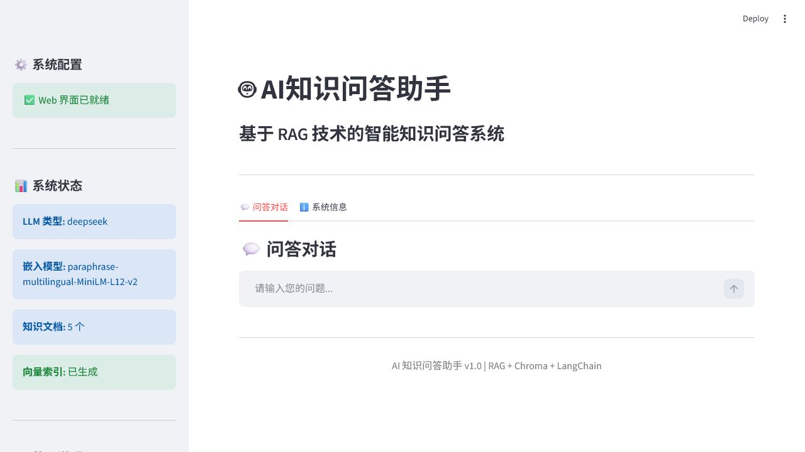
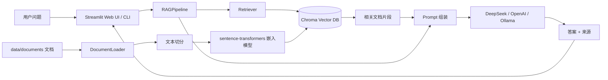

# AI Knowledge Base RAG Assistant

一个基于 RAG（Retrieval-Augmented Generation，检索增强生成）的中文知识库问答项目。项目会读取 `data/documents/` 下的 PDF、Markdown、TXT、DOCX 文档，使用 sentence-transformers 生成向量，存入 Chroma，并通过 DeepSeek / OpenAI / Ollama 生成带知识库上下文的回答。

## 一键运行

### Windows

双击 `run.bat`，或在 PowerShell 中执行：

```powershell
.\run.ps1
```

### macOS / Linux

```bash
bash run.sh
```

一键脚本会自动完成：

- 创建 `.venv` 虚拟环境
- 安装 `requirements.txt` 依赖
- 首次运行时从 `.env.example` 生成 `.env`
- 首次运行时构建 `vector_db` 向量索引
- 启动 Streamlit Web 界面：`http://localhost:8501`

首次运行会下载嵌入模型，耗时取决于网络环境。要获得真实问答效果，请先在 `.env` 中填入 DeepSeek / OpenAI API Key，或切换为本地 Ollama。

## 运行截图



## 架构图



## 环境依赖

- Python 3.9+
- pip
- Windows PowerShell，或 macOS / Linux Bash
- 可访问 Hugging Face 模型下载地址，首次运行需要下载嵌入模型
- LLM 二选一：
  - DeepSeek API Key
  - OpenAI API Key
  - 本地 Ollama 服务

主要 Python 依赖：

- `langchain`, `langchain-community`, `langchain-openai`, `langchain-chroma`
- `chromadb`
- `sentence-transformers`, `torch`
- `streamlit`
- `pypdf`, `python-docx`, `docx2txt`, `unstructured`
- `python-dotenv`

## 配置

复制环境变量模板：

```bash
cp .env.example .env
```

DeepSeek 示例：

```env
LLM_TYPE=deepseek
DEEPSEEK_API_KEY=your_deepseek_api_key_here
DEEPSEEK_BASE_URL=https://api.deepseek.com
DEEPSEEK_MODEL=deepseek-chat
```

OpenAI 示例：

```env
LLM_TYPE=openai
OPENAI_API_KEY=your_openai_api_key_here
```

Ollama 示例：

```env
LLM_TYPE=ollama
OLLAMA_HOST=http://localhost:11434
OLLAMA_MODEL=llama2
```

## 启动命令

一键启动 Web：

```bash
# Windows
.\run.ps1

# macOS / Linux
bash run.sh
```

手动启动：

```bash
python -m venv .venv

# Windows
.\.venv\Scripts\activate

# macOS / Linux
source .venv/bin/activate

pip install -r requirements.txt
cp .env.example .env
python main.py --mode index --force
streamlit run web_app.py --server.port 8501
```

命令行问答：

```bash
python main.py --mode query --question "什么是检索增强生成？"
```

交互式命令行：

```bash
python main.py --mode interactive
```

查看系统信息：

```bash
python main.py --mode info
```

清空向量库：

```bash
python main.py --mode clear
```

## 项目结构

```text
.
├── data/documents/        # 知识库原始文档
├── main.py                # CLI 入口
├── web_app.py             # Streamlit Web UI
├── rag_pipeline.py        # RAG 问答流程
├── document_loader.py     # 文档加载与切分
├── vector_store.py        # Chroma 向量库管理
├── config.py              # 环境变量与系统配置
├── requirements.txt       # Python 依赖
├── run.ps1                # Windows 一键运行脚本
├── run.bat                # Windows 双击启动入口
├── run.sh                 # macOS / Linux 一键运行脚本
└── docs/images/           # README 截图
```

## 知识库更新

1. 把新的 PDF / TXT / DOCX / Markdown 文件放到 `data/documents/`
2. 重建向量索引：

```bash
python main.py --mode index --force
```

3. 重新启动 Web 服务

## 注意事项

- `.env` 不会提交到 Git，避免泄露 API Key。
- `vector_db/` 是本地生成的向量索引，不提交到 Git；克隆后由脚本自动重建。
- 如果需要离线运行，请先在联网环境下载嵌入模型，再设置 `HF_HUB_OFFLINE=1` 和 `TRANSFORMERS_OFFLINE=1`。
